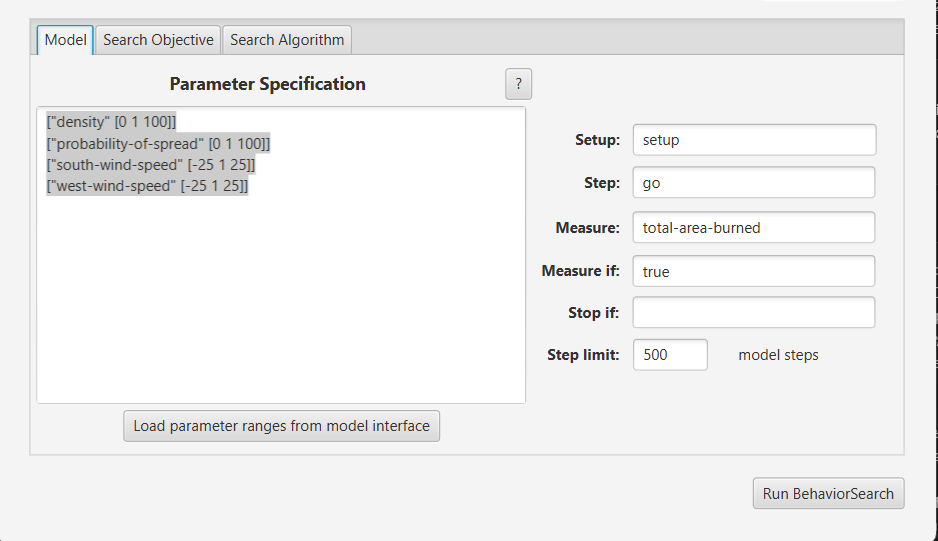
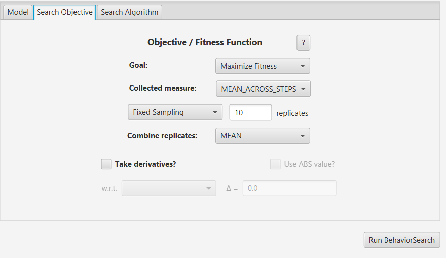
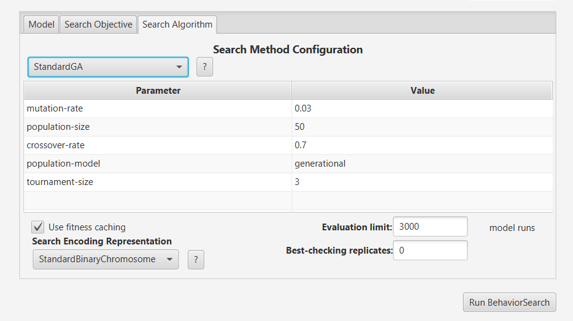
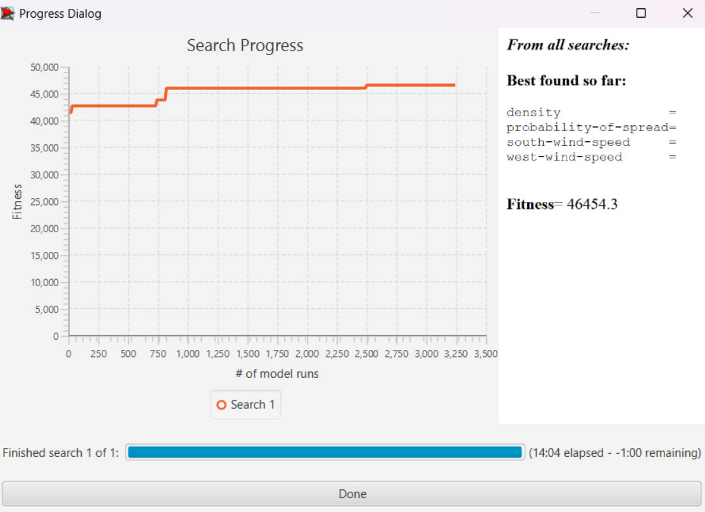
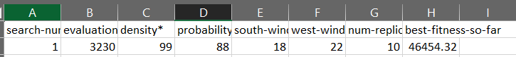
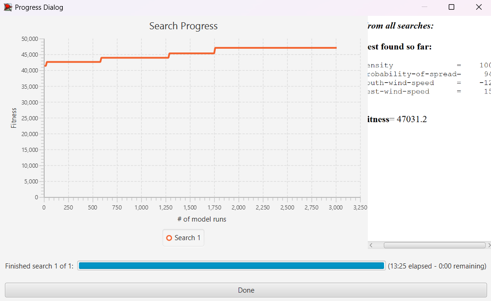
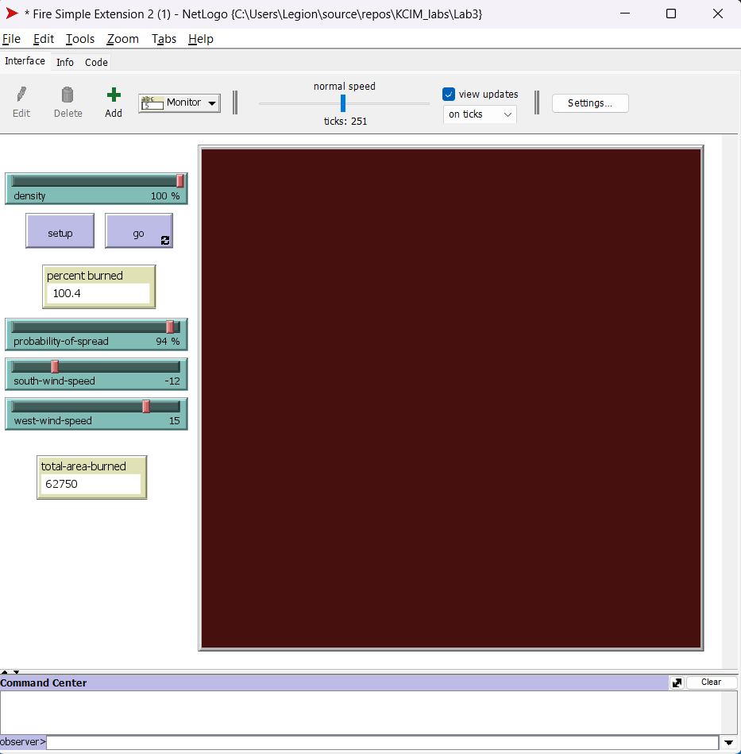

## Комп'ютерні системи імітаційного моделювання
## СПм-23-3, **Ілларіонов Максим Юрійович**
### Лабораторна робота №**3**. Використання засобів обчислювального интелекту для оптимізації імітаційних моделей

 

### Варіант 5, модель у середовищі NetLogo:
[Fire Simple Extension 2.](http://www.netlogoweb.org/launch#http://www.netlogoweb.org/assets/modelslib/IABM%20Textbook/chapter%203/Fire%20Extensions/Fire%20Simple%20Extension%202.nlogo)

 

#### Вербальний опис моделі:

Симуляція поширення вогню в лісі починається з лінії загоряння, яка виникає на лівій (західній) частині симуляції. Вогонь поширюється на протилежний бік відповідно до заданих правил та параметрів. Кожна клітина, що палає, має ймовірність передати вогонь на сусідні клітини лісу. На початку симуляції визначається густота лісу, а шанс поширення вогню залежить від відповідного параметра та напрямку вітру.

### Керуючі параметри:
- **density** задає густоту лісового покриву на площині.
- **probability of spread** задає початкову ймовірність поширення вогню на сусідню клітинку.
- **south-wind-speed** задає інтенсивність південного вітру.
- **west-wind-speed** задає інтенсивність західного вітру.

### Внутрішні параметри:
- **initial-trees**. Конкретна кількість дерев на початку симуляції.

### Показники роботи системи:
- **percent burned** - Відносна кількість сгорівших дерев.

 

### Налаштування середовища BehaviorSearch:

**Обрана модель**:
<pre>
C:\KCIM\Lab3\Fire Simple Extension 2 (1).nlogo
</pre>

**Параметри моделі** (вкладка Model):  
*Параметри та їх можливі діапазони були **автоматично** отримані середовищем BehaviorSearch із обраної симуляційної моделі:

<pre>
["density" [0 1 100]]
["probability-of-spread" [0 1 100]]
["south-wind-speed" [-25 1 25]]
["west-wind-speed" [-25 1 25]]
</pre>

Застосована **метрика**:
Для фітнес-функції  було обрано **кількість згорівшого лісу**

Для вимірювання цього показника було змінено код початкової моделі.

<pre>
globals [
  initial-trees   ;; how many trees (green patches) we started with
  total-area-burned  ;; to keep track of the total area burned
]
</pre>

 

У процедурі setup ініціалізується обрана глобальна змінна.
<pre>
  set total-area-burned 0  ;; initialize the total area burned
</pre>

У процедурі go інкрементується обрана глобальна змінна в разі кожного згорілого дерева.
<pre>
      if random 100 < probability [
        set pcolor red ;; to catch on fire
        set total-area-burned total-area-burned + 1  ;; increase the total area burned
      ]
</pre>

Кінцева кількість згорілих дерев повинна враховуватися **в середньому** протягом усього періоду симуляції тривалістю, *наприклад*, 500 тактів, починаючи з 0-го такту симуляції.

Параметр зупинки за умовою ("**Stop if**") не використовувався.
Загальний вигляд вкладки налаштувань параметрів моделі:

**Налаштування цільової функції** (вкладка Search Objective):
Метою підбору параметрів імітаційної моделі, що описує палаючий ліс, є **максимізація** кількості згорілого лісу, що вказано через параметр **Goal** зі значенням **Maximize Fitness**. Тобто, потрібно визначити такі параметри налаштувань моделі, при яких кількість згорілого лісу буде максимальною. Важливою є не просто кількість згорілого лісу в окремий момент часу, а середнє значення цього показника за всю симуляцію (яка триває 500 кроків, як вказано на попередній вкладці). Для цього у параметрі **Collected measure**, що визначає спосіб обліку значень обраного показника, встановлено **MEAN_ACROSS_STEPS**.

Щоб уникнути спотворення результатів через випадкові значення, що використовуються в логіці самої імітаційної моделі, **кожна симуляція повторюється 10 разів**, а результуюче значення розраховується як **середнє арифметичне**.
Загальний вигляд вкладки налаштувань цільової функції:

**Налаштування алгоритму пошуку** (вкладка Search Algorithm):  

 

### Результати використання BehaviorSearch:

Результат пошуку параметрів імітаційної моделі за допомогою **генетичного алгоритму**:

Цифрові результати пошуку за допомогою генетичного алгоритму були скорочені на рисунку, тому нижче наведені кінцеві результати пошуку, згенеровані програмою BehaviorSearch, у вихідному файлі.

Результат пошуку параметрів імітаційної моделі за допомогою **випадкового пошуку**:

### Перевірка та порівняння результатів дослідження:

Для відображення досліджуваного показника був доданий монітор, який показує кінцеву кількість згорілих дерев.

Результати віпробування кінцевих параметрів отриманих з ГА

Результати віпробування кінцевих параметрів отриманих з випадкового алгоритму

Обидва результати представляють коректний набір параметрів, який призводить до максимального або близького до максимального показника кількості згорілих дерев. Окремо слід відзначити абсолютну точність результатів випадкового пошуку, який визначив параметри, що гарантують максимальну кількість згорілих дерев. У той же час, StandartGA виявився менш ефективним, але все одно дуже точним.